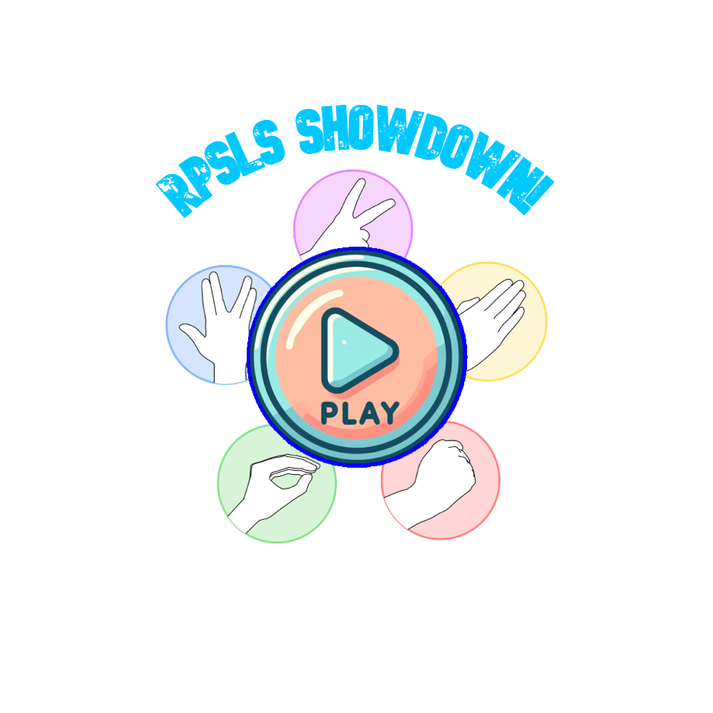
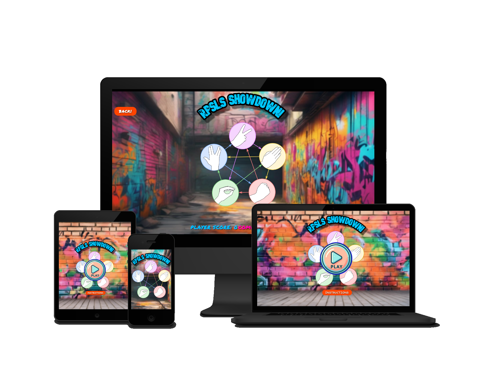
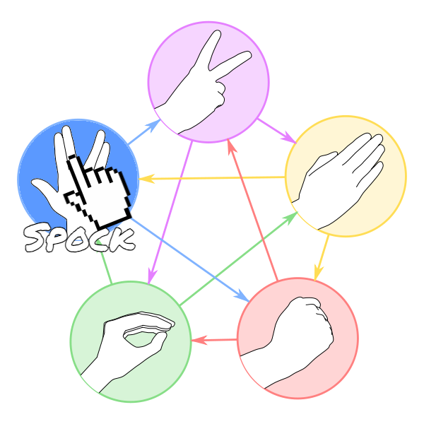

# Rock-Paper-Scissors-Lizard-Spock Web Application

## Table of Contents
- [Introduction](#introduction)
- [Target Audience](#target-audience)
- [Design Decisions](#design-decisions)
- [Deployment Procedure](#deployment-procedure)
- [Game Description](#game-description)
- [Features](#features)
- [Testing](#testing)
- [Deployment](#deployment)
- [Credits](#credits)

## Introduction
This web application implements the popular game "Rock-Paper-Scissors-Lizard-Spock". It allows users to play against the computer, providing an enjoyable and engaging experience.

## Target Audience
The target audience for this web application includes:
- Gamers looking for a fun and challenging experience.
- Individuals seeking entertainment during leisure time.
- Developers interested in learning about game development and interactive web design.
- Or TBBT Fans ;)

## Design Decisions
- **User Interaction**: The web application uses intuitive buttons and hover effects to enhance user interaction.
- **Visual Design**: The interface incorporates vibrant colors and dynamic elements to create an engaging experience.
- **Responsive Layout**: Utilizes media queries to ensure compatibility with various screen sizes, enhancing accessibility.
- **Game Logic**: Implements a fair game logic based on the rules of "Rock-Paper-Scissors-Lizard-Spock", providing an enjoyable gaming experience.

## Deployment Procedure
To deploy the web application, follow these steps:

### Cloning the Repository
1. Navigate to the repository's main page on GitHub.
2. Click on the "Code" button.
3. Copy the repository URL.
4. Open a terminal and run `git clone [repository URL]`.

### Forking the Repository
1. Navigate to the repository's main page on GitHub.
2. Click on the "Fork" button at the top right corner of the page.
3. Follow the prompts to fork the repository to your GitHub account.

### Running Locally
1. Clone the repository to your local machine.
2. Ensure you have a modern web browser installed.
3. Open the `index.html` file in your web browser.
4. Start playing and enjoy the game!

## Game Description

Rock Paper Scissors Lizard Spock (RPSLS) is a web-based game that offers a modern twist on the classic game of Rock Paper Scissors. The game aims to provide entertainment for users of all ages, offering an engaging and interactive experience.

## Features

1. **Main Menu**
   - Allows users to navigate between different sections of the game, including gameplay and instructions.
   - Features a visually appealing design with intuitive navigation options.

2. **Gameplay Page**
   - Provides an interactive interface for players to make their choices from five options: rock, paper, scissors, lizard, or Spock.
   - Displays both player and computer choices, along with the outcome of each round.
   - Tracks and displays the score for both the player and the computer.
   - Includes a next round button to facilitate continuous play.

3. **Endgame Page**
   - Displays a "Game Over" message at the end of each game.
   - Allows users to restart the game or return to the main menu.

4. **Instructions Page**
   - Offers clear and concise instructions on how to play the game.
   - Includes visuals to aid users in understanding the rules and making their choices.

### Features Left to Implement

- **Multiplayer Mode**: Allow users to play against friends or other online players.
- **Customizable Settings**: Enable users to adjust game parameters such as difficulty level and game duration.
- **Leaderboard**: Implement a feature to track high scores and display them on the main menu.

## Testing

The game has undergone extensive testing to ensure functionality across different browsers and devices.

### Validator Testing

- **HTML**
  - No errors were returned when passing through the official [W3C validator](https://validator.w3.org/nu/?doc=https%3A%2F%2Fcode-institute-org.github.io%2Flove-running-2.0%2Findex.html)
- **CSS**
  - No errors were found when passing through the official [(Jigsaw) validator](https://jigsaw.w3.org/css-validator/validator?uri=https%3A%2F%2Fvalidator.w3.org%2Fnu%2F%3Fdoc%3Dhttps%253A%252F%252Fcode-institute-org.github.io%252Flove-running-2.0%252Findex.html&profile=css3svg&usermedium=all&warning=1&vextwarning=&lang=en#css)

### Unfixed Bugs

No major bugs were discovered during testing. Minor issues related to styling may be present on certain screen sizes, which will be addressed in future updates.

## Deployment

The game was deployed to a hosting platform (e.g., GitHub Pages) using the following steps:

1. Navigate to the GitHub repository's Settings tab.
2. From the source section drop-down menu, select the Master Branch.
3. The page will be automatically refreshed to indicate successful deployment.
4. The live link to the deployed game can be found [here](https://vretinger.github.io/RPSLS-Showdown/).

## Credits

### Content

- Game rules and instructions were adapted from various online sources.

### Media

- Images and icons used in the game were sourced from open-source libraries and repositories. But mainly created using AI such as Copilot.

